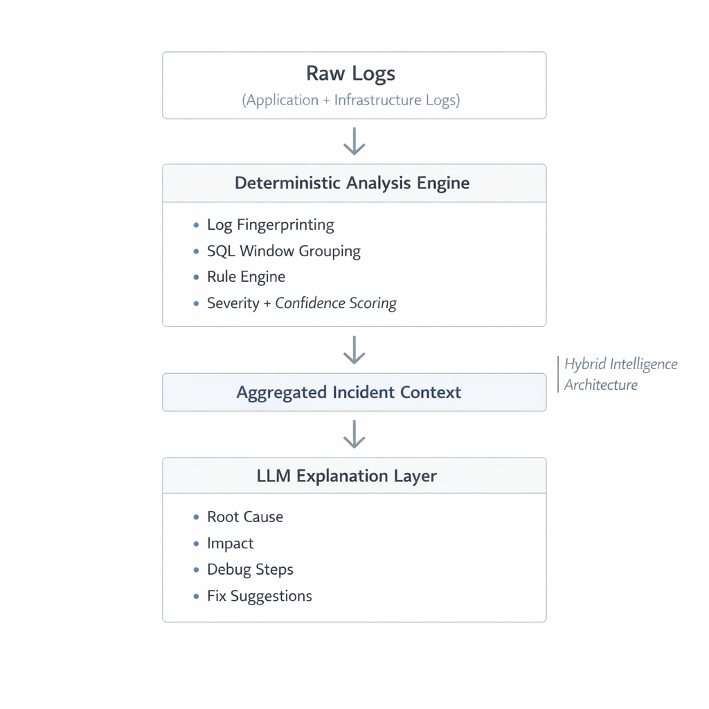

# 🚨 AI Ops Assistant

> Intelligent log ingestion, fingerprinting, incident grouping, rule-based findings, and AI-powered explanations.

A production-style backend system that ingests raw logs, structures them, groups similar events, detects critical findings, and generates explainable AI insights — designed with real-world backend architecture in mind.

## Table of Contents

- [Why I Built This](#-why-i-built-this)
- [Architecture Overview](#-architecture-overview)
- [System Design Decisions](#-system-design-decisions)
- [Features](#-features)
- [Tech Stack](#-tech-stack)
- [Multi-Tenant Structure](#-multi-tenant-structure)
- [Example Output](#-example-output)
- [Running Locally](#-running-locally)
- [What This Project Demonstrates](#-why-this-project-matters)

## 🔥 Why I Built This

In production systems, logs are noisy. Engineers waste time scanning hundreds of lines to understand:

- **What actually happened?**
- **Is this a real incident?**
- **Is it recurring?**
- **What's the root cause?**

This project simulates a real **AIOps pipeline**:

1. Parse raw logs
2. Normalize and fingerprint events
3. Group similar incidents
4. Detect rule-based findings
5. Generate structured AI explanations
6. Expose everything through clean APIs

**Built as if it were a real SaaS platform.**

## 🧠 Architecture Overview


```
Raw Logs
   ↓
Parser + Normalizer
   ↓
Fingerprinting Engine
   ↓
Grouped Incidents (by fingerprint)
   ↓
Findings Engine (rule-based detection)
   ↓
LLM Explanation Layer (optional AI analysis)
   ↓
REST API
```

### Key Architectural Ideas

- **Deterministic analysis first** — rules and grouping before AI
- **AI only as an explanation layer** — never as primary detection
- **Fully asynchronous processing** — Celery + Redis
- **Multi-tenant structure** — Organizations → Projects → Ingestions
- **Server-side filtering + pagination** — scalable queries
- **Production-ready database schema design** — normalized, indexed, optimized

## 🏗️ System Design Decisions

### 1️⃣ Fingerprinting Strategy

Logs are grouped by **fingerprint** (hash of normalized message). This allows:

- **Incident deduplication** — eliminate noise
- **Volume-based prioritization** — focus on top issues
- **Efficient aggregation** — group similar events

### 2️⃣ Two-Pass Findings Engine

- **Pass 1** → Analyze top fingerprint groups (high signal)
- **Pass 2** → Analyze individual ERROR events (catch rare critical issues)

This prevents missing low-frequency but high-severity incidents.

### 3️⃣ AI as a Safe Layer

The LLM:

- Does **NOT invent facts**
- Uses **only provided evidence**
- **Cites log sequence numbers**
- Produces **structured output**

AI never replaces deterministic detection — it **enhances it**.

## 🚀 Features

### Log Processing

- ✅ Paste logs directly
- ✅ Upload log files
- ✅ Demo log generator (frontend)
- ✅ Asynchronous ingestion pipeline

### Incident Analysis

- ✅ Event pagination (cursor-based)
- ✅ Server-side filtering:
  - Levels
  - Services
  - Time range
  - Free-text search
  - Fingerprint
- ✅ Grouped incident view with:
  - Total occurrences
  - First seen / last seen
  - Level & service breakdown
  - Drill-down into group events
  - AI explanation per group

### Findings Engine

Detects critical patterns:

- OOM errors
- DB connection failures
- TLS errors
- Rate limits
- Upstream timeouts
- Disk full
- Payment failures
- Generic critical patterns

Each finding includes:

- Severity level
- Confidence score
- Evidence extraction
- Matched fingerprints
- AI-generated incident explanation

### AI Insight Layer

- ✅ Per-group analysis
- ✅ Per-finding analysis
- ✅ Cached results
- ✅ Structured output

## 🧩 Tech Stack

### Backend

- **FastAPI** — modern async web framework
- **SQLAlchemy** — ORM with advanced query support
- **PostgreSQL** — robust relational database
- **Redis** — caching & message broker
- **Celery** — task queue (workers + beat scheduler)
- **Alembic** — database migrations
- **Docker** — containerization

### AI Layer

- **Groq API** — fast inference
- **Structured prompt engineering** — reliable output
- **Evidence-cited outputs** — explainable results

### Frontend

- **React** (Vite) — fast development
- **shadcn/ui** — accessible components
- **Tailwind CSS** — utility-first styling
- **Server-driven filtering** — smart query optimization

### Deployment

- **Dockerized backend** — ready for production
- **Designed for Render / Railway** — easy deployment
- **Vercel frontend** — optimal static hosting

## 🗂️ Multi-Tenant Structure

```
Organization
 └── Project
      └── Ingestion
           ├── Overview
           ├── Events
           ├── Groups
           └── Findings
```

### Role-Based Organization Membership

- **Admin** — full control
- **Member** — limited access

Supports:

- Invite users
- Promote/demote roles
- Remove members
- Delete projects/orgs

## 📊 Example Output (AI Explanation)

```
What this finding means
This finding indicates that the system has detected an "Out of memory / heap exhaustion" issue, which means that the application has run out of memory to allocate to its processes, leading to a potential crash or failure. This can cause the application to become unresponsive or fail to perform its intended functions.

Why it was flagged
The system flagged this issue because it matched a specific pattern defined by the "oom_memory" rule, which is designed to detect out-of-memory errors. The evidence that supports this flagging is the occurrence of a Java "OutOfMemoryError: Java heap space" exception in the logs (evidence: seq 80). This exception is a clear indication that the application has exhausted its available memory.

Severity and impact
The severity of this finding is marked as "CRIT", indicating that it is a critical issue that requires immediate attention. The impact of this issue is unknown, as the context does not provide information on the specific effects of the out-of-memory error on the application or its users.

Debugging steps
To debug this issue, the following steps can be taken:

Review the application's memory usage patterns to identify potential memory leaks.
Check the application's configuration to ensure that the heap size is set appropriately.
Monitor the application's performance to identify any trends or patterns that may be contributing to the out-of-memory error.
Analyze the application's code to identify any areas where memory is not being properly released.
Consider increasing the heap size or optimizing the application's memory usage to prevent future out-of-memory errors.
Review the application's logging to identify any other errors or issues that may be related to the out-of-memory error.
Use profiling tools to identify any performance bottlenecks or areas where the application is using excessive memory.
Fix suggestions
Quick fixes
Increase the heap size to provide more memory to the application.
Restart the application to temporarily resolve the out-of-memory error.
Durable fixes
Optimize the application's memory usage to prevent future out-of-memory errors.
Identify and fix any memory leaks in the application's code.
Consider using a more efficient data structure or algorithm to reduce memory usage.
Evidence cited
The key evidence that supports this finding is the occurrence of a Java "OutOfMemoryError: Java heap space" exception in the logs (evidence: seq 80). This exception is a clear indication that the application has exhausted its available memory. Since there is only one fingerprint and one event, there is no comparison to be made between different fingerprints.
```

## 🛠️ Running Locally

```bash
docker compose up --build
```

- **API** → http://localhost:8000
- **Health check** → `/health`
- **Frontend** → http://localhost:5173 (if running separately)

## 🧪 Why This Project Matters

This project demonstrates:

- ✅ **Backend architecture design** — clean, scalable patterns
- ✅ **Database modeling** — normalized schema with indexes
- ✅ **Window functions & aggregation** — advanced SQL queries
- ✅ **Async task orchestration** — Celery pipelines
- ✅ **Clean API design** — RESTful principles
- ✅ **AI integration without hype** — practical LLM usage
- ✅ **Real-world production thinking** — observability, error handling

**It is not a toy CRUD app — it simulates a real incident analysis platform.**

## 📌 What I Focused On

1. **Deterministic logic before AI** — rules come first
2. **Clean separation of concerns** — modular architecture
3. **Scalable schema design** — handles large datasets
4. **Clear domain modeling** — business logic clarity
5. **Safety and observability** — production-ready logging
6. **Maintainability over shortcuts** — long-term code health
